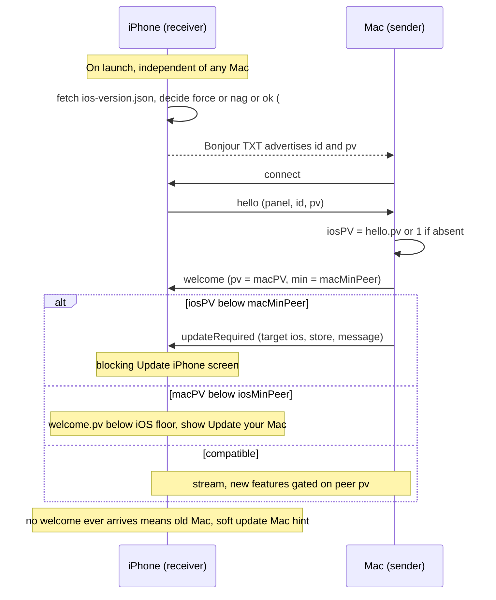

# Mac ↔ iOS compatibility

How the two OpenDisplay apps stay compatible when they update on **different
schedules**, who is responsible for detecting a mismatch, and what pairings we
support. This is the spec for issues
[#132](https://github.com/peetzweg/opendisplay/issues/132) (release
orchestration), [#135](https://github.com/peetzweg/opendisplay/issues/135)
(force update), and the wire-protocol handshake.

> Status: **draft / not yet fully implemented.** Phase 1 (version on the wire +
> the remote-config force lever) is in progress. Sections marked _(planned)_
> describe target behavior.

---

## 1. The problem

We cut Mac and iOS from one release tag, but distribution is not simultaneous:

| | Update channel | Time to reach a user |
|---|---|---|
| **Mac** | Sparkle appcast (`opendisplay.app/appcast.xml`) | hours — auto, silent |
| **iOS** | App Store (review + user tapping Update) | days → weeks, with a **long tail** |

So at any moment the field holds many version pairings. The dominant one is
**new Mac + old iPhone** (Mac raced ahead via Sparkle). But the reverse also
happens: iOS auto-update is on for most users, so a phone can jump to a build
whose Mac counterpart the user hasn't installed yet — **new iPhone + old Mac**.

Concretely, roughly half the iOS base sat on an _older_ release than the latest
at the time of writing (~2.5k users per version). We cannot assume the two ends
are in lockstep, ever.

## 2. Two different versions

Keep these separate — conflating them is the trap:

- **App version** (`MARKETING_VERSION`, e.g. `0.11.0`) — what users see, tied to
  the App Store / Sparkle release. Bumped every release.
- **Protocol version** (`pv`, an integer) — the wire contract between the apps.
  Bumped **only when the wire changes**, not every release. A release that only
  touches UI leaves `pv` untouched, so it never triggers a compatibility event.

**Absent `pv` = protocol `1`.** Every install in the field today predates the
handshake and sends no version, so it is defined as protocol 1. New builds send
`pv ≥ 2`.

Each side also declares **`minPeer`** — the oldest peer `pv` it still supports.
Both start at `1` (support everything). We only raise a `minPeer` as the second
half of a deliberate two-phase breaking change (§6).

## 3. Compatibility matrix

Let `iosPV` / `macPV` be the two protocol versions, and `macMinPeer` /
`iosMinPeer` the minimum-supported-peer each side declares.

| Condition | Meaning | Outcome |
|---|---|---|
| `iosPV ≥ macMinPeer` **and** `macPV ≥ iosMinPeer` | fully compatible | **Stream normally.** New-but-optional features are gated on the peer's `pv` and simply stay off for older peers. |
| `iosPV < macMinPeer` | iPhone too old for this Mac | **Update the iPhone.** Mac detects it (it sees `iosPV`), drives the UI. |
| `macPV < iosMinPeer` | Mac too old for this iPhone | **Update the Mac.** iPhone detects it (it sees `macPV`), drives the UI. |
| both of the above | both behind their floors | Both need updating; each device shows the action that fixes _it_. |

Because `minPeer` stays at `1` by default, the "too old" rows are **empty in
normal operation** — they only light up after we deliberately raise a floor for
a breaking change. Day-to-day, everything is the top row: compatible, with
newer features gated off for older peers.

## 4. Who checks what — and why it can't live on one side alone

**Instinct:** "put the compatibility check solely in the Mac app." Mostly right,
with one hard exception. The Mac _is_ the natural primary owner:

- It updates first and continuously, so the Mac in the field is always the
  freshest app and can carry the newest, smartest compatibility table.
- It already receives the iPhone's `pv` in `hello`, so it can evaluate the pair
  and **tell the iPhone what to show** (`updateRequired`). The iPhone stays dumb.

**The exception — the side that needs updating may be too old to know it.** If a
Mac is old enough to be incompatible with a _newer_ iPhone, it may predate the
handshake entirely and cannot diagnose its own obsolescence. Only the **new
iPhone** can see that the Mac is behind. So the "update your Mac" nudge has to be
able to originate on **iOS**.

Ownership therefore splits:

| Detection | Owner | Mechanism |
|---|---|---|
| iPhone too old for the Mac (common case) | **Mac** (primary) | reads `hello.pv`; sends `updateRequired` → iPhone renders "Update iPhone"; shows a local menu-bar hint too |
| Mac too old for the iPhone | **iOS** | reads `welcome.pv` (or notices no `welcome` arrives at all → old Mac); renders "Update your Mac" |
| Install that never meets a capable Mac (e.g. the old-version tail) | **iOS** | remote-config force lever (§5) — the _only_ thing that reaches it |

**Rule of thumb:** each app enforces its own `minPeer` against the peer's
advertised `pv`; whichever app is new enough to _detect_ the mismatch is the one
that surfaces the nudge — for the peer's device if that's what needs updating.

So: Mac is the primary owner and single source of truth for policy, but it
**cannot be the sole owner.** iOS keeps a minimal check for the "old Mac"
direction and owns the offline/never-connect case.

## 5. The remote-config force lever (iOS) — issue #135

Connection-independent. On launch the iPhone fetches a small static file we host
next to the Sparkle appcast:

- **URL:** `https://opendisplay.app/ios-version.json` (source of truth:
  `public/ios-version.json`; Vite copies it into `docs/` and Pages serves it).
- **Shape:**
  ```json
  {
    "ios": {
      "hardMinimumVersion": "0.0.0",
      "recommendedVersion": "0.11.0",
      "storeURL": "itms-apps://apps.apple.com/app/id6780264891",
      "message": "…"
    }
  }
  ```
- `version < hardMinimumVersion` → **blocking** update screen (App Store deep
  link, non-dismissible). This is the force.
- `hardMinimumVersion ≤ version < recommendedVersion` → **soft, dismissible** nag.
- **`hardMinimumVersion` is the force floor: hand-edited via PR, deliberately and
  rarely.** It must _not_ auto-track "latest" or every release would force an
  update (the opposite of what we want). `recommendedVersion` may be
  CI-auto-stamped, like the appcast.
- **Fails open:** any network/parse error, or a dormant `0.0.0` floor, shows no
  gate — a Pages outage can never brick the app. Dev builds (`0.0.0`) skip the
  check entirely.

Why this is the lever that matters: **you cannot force-update an install that
doesn't already contain the force-check.** The current old-version tail has no
check at all — the app can only ever force builds that shipped _with_ it. So we
ship the check now (dormant floor) to start the saturation clock, and only raise
the floor once a force-capable build has spread.

## 6. What we support — and what we don't

**Supported:**

- **Additive changes are free and default.** New optional `hello`/`welcome`
  fields and new message types, gated on the peer's `pv`. Both apps already
  log-and-ignore unknown message types and tolerate missing optional fields, so
  additive changes never break an older peer.
- Mac supports iOS receivers **≥ N releases back** — _N is TBD (see open
  questions); until decided, "all protocol-1 receivers."_
- iOS supports Macs back to protocol 1 (no floor raised yet).

**Breaking changes are two-phase (never one-shot):**

1. **Release 1** ships support for _both_ old and new behavior on _both_ apps,
   the new path gated on `pv`. Nothing breaks; the new path only activates when
   both peers are new enough.
2. **Release 2**, only after the iOS build has had an App Store adoption window,
   raises the relevant `minPeer` and deletes the old path. Now old peers get a
   clean "please update" instead of a silent break.

**Not supported / hazards:**

- **Silent breaking changes.** Never change framing or field semantics without
  the two-phase dance — the failure mode is an invisible reconnect loop, not a
  message.
- **Control frames ≥ 32 KB or containing a NUL byte on the video channel.** The
  phone disambiguates JSON control vs. H.264 frames heuristically (`< 32 KB,
  starts with '{', no NUL`). A large or binary control message would be fed to
  the video decoder. A typed frame header is a future protocol item, unlocked
  only because this handshake exists.
- **Forcing the pre-handshake tail via the app.** Installs older than the first
  force-capable build have no lever — they are reachable only by the Mac's
  in-session `updateRequired` (if they connect to a new-enough Mac) or they
  simply stop working. Graceful degradation for them is mandatory _during the
  transition_, not a standing commitment.

## 7. Message flow _(planned)_



## 8. Transition plan

1. **Now:** ship, in the _same_ iOS build — `pv` on the wire, `welcome`
   handling, `updateRequired` handling, and the remote-config check. Mac ships
   `pv` + `welcome` + `updateRequired` sender. **All floors stay at `1` /
   `hardMinimumVersion` stays `0.0.0` (dormant).** Nobody is forced yet; the goal
   is only to get the machinery into the field.
2. **Saturate:** watch per-version adoption. The levers do nothing until a
   capable build is widespread.
3. **Flip, when justified:** raise `ios-version.json`'s `hardMinimumVersion` to
   retire an ancient iOS base, and/or run a two-phase `minPeer` raise for a
   specific breaking change. Every transition/graceful shim lands with a removal
   ticket.

## 9. Open questions (need a decision)

- **`N`** — how many iOS releases back must the Mac support before we're allowed
  to drop a path? ("All v1" is the placeholder.)
- **Incompatible pair: refuse or degrade?** Recommendation: keep the link and
  degrade during the transition; only refuse-to-connect after a floor is
  deliberately raised.
- **"Update your Mac" severity on iOS** — blocking or soft? Recommendation: soft
  hint unless `macPV < iosMinPeer` (a real hard floor), then blocking.
